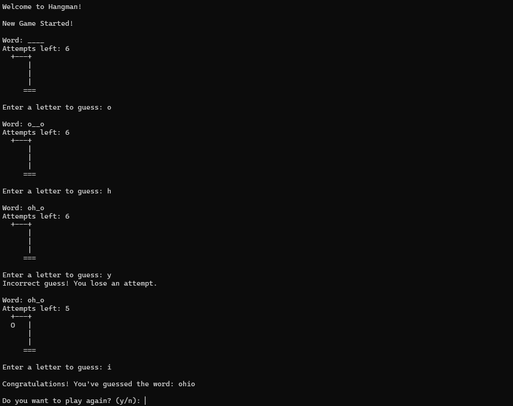

# Hangman Game

A simple and interactive Hangman game developed in C. This game allows players to guess a hidden word by entering one letter at a time, with limited attempts before the stickman is fully drawn and the game is over.

---

## Features

- **Dynamic Gameplay**: Words are chosen randomly from a predefined list.
- **ASCII Art Hangman**: Visual representation of the hangman that updates with incorrect guesses.
- **Customizable Word List**: Easily extend the game by adding more words.
- **Replay Option**: Players can choose to restart the game after winning or losing.

---

## How to Play

1. A random word is selected by the program.
2. Players guess the word by entering one letter at a time.
3. Incorrect guesses result in parts of the hangman being drawn.
4. The game ends either when the player guesses the word or when the hangman is fully drawn.

---

## Technologies Used

- **Programming Language**: C
- **Compiler**: GCC or any other C compiler of your choice

---

## Installation

1. Clone the repository or download the source code:

   ```bash
   git clone https://github.com/proobker/Hangman_Game.git
   ```

2. Navigate to the project directory:

   ```bash
   cd Hangman_Game
   ```

3. Compile the program using GCC:

   ```bash
   gcc hangman.c -o hangman
   ```

4. Run the game:

   ```bash
   ./hangman
   ```

---

## Usage

1. Run the compiled program in your terminal.
2. Follow the prompts to enter your guesses.
3. The hangman figure will update as you guess incorrectly.
4. Enjoy the game and try to guess the word before the hangman is fully drawn!

---

## Screenshot




---

## Contribution

Contributions are welcome! Follow these steps to contribute:

1. Fork this repository.
2. Create a new branch:
   ```bash
   git checkout -b feature-name
   ```
3. Commit your changes:
   ```bash
   git commit -m "Add feature description"
   ```
4. Push to the branch:
   ```bash
   git push origin feature-name
   ```
5. Create a pull request.

---

## License

This project is licensed under the [MIT License](LICENSE).

---

## Contact

For queries or feedback, contact:

- **Email**: [rrabi.dahal@gmail.com](mailto\:rrabi.dahal@gmail.com)
- **GitHub**: [proobker](https://github.com/proobker)

---

Thank you for exploring this repository! We hope you enjoy playing Hangman.
